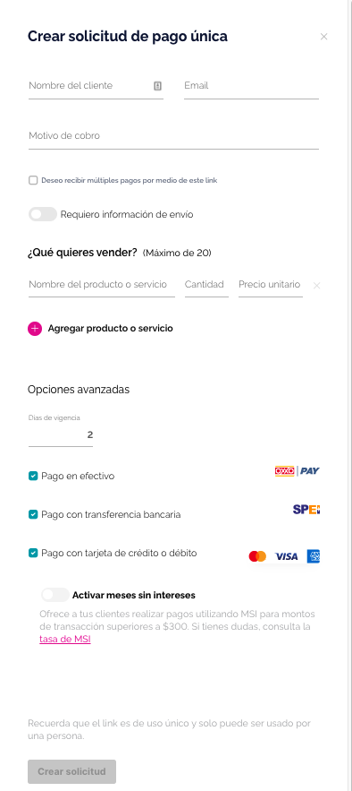
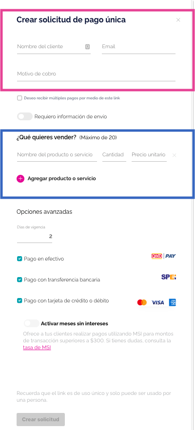

# Payment link
El objetivo principal del payment link es crear una enlace de pago
para compartir con nuestros clientes mediante whatsapp y correo.



## Criterios de aceptación.
- Como usuario quiero poder crear un link de pago con n cantidad
  de productos o servicios para que mis clientes puedan pagarme.
- Como usuario quiero poder crear un link de pago multiple para poder recibir
  varios pagos de diferentes clientes.
- Como usuario quiero poder solicitar información de envio para que mis
  clientes me compartan su dirección donde recibieran su producto o servicio.
- Como usuario quiero poder limitar los días de vigencia de mi link de pago
  para realizar promociones.
- Como usuario quiero poder ofrecer a mis clientes pagos mediante OXXO, transferencia
  interbancaria y pago con tarjeta de crédito o débito para que
  mis clientes tengan diferentes facilidades de pago.
- Como usuario quiero ofrecer meses sin intereses para que mis clientes
  tenga otra faclidad de pago.
  
## Manos a la obra

Analicemos el primer criterio de aceptación e identifiquemos en la 
imagen las secciones que necesitamos para cumplir con el criterio.



Hemos identificado dos secciones necesarias para cumplir
con el criterio. 

Ambas secciones las vamos a encapsular en dos componentes
por separado ¿por qué hacemos esto? Uno porque
podemos realizar pruebas mucho más fácil, y
segundo porque cada componente tendrá una responsabilidad
única.

***views/PaymentsLink/PaymentsLinkClientInfo.js***
***views/PaymentsLink/PaymentsLinkProductsGenerator.js***

Comencemos creando el componente de test para PaymentsLinkProductsGenerator
***tests/views/PaymentsLink/PaymentLinkProductsGenerator.test.js***

Identifiquemos los casos de este componente

```
describe("PaymentsLinkProductsGenerator", function() {
  
  it("Alta de un producto con nombre, cantidad y precio unitario", () => {
  });

  it("Alta de más de un producto", () => {
  });

  it("Eliminar un producto", () => {
  });

  it("Mostrar un error cuando un campo venga vacío", () => {
  });
});
```

### Caso 1 - Alta de un producto con nombre, cantidad y precio unitario

```
it("Alta de un producto con nombre, cantidad y precio unitario.", () => {
    // Definimos los props de nuestro componente
    // Creamos un mock para comprobar que los productos
    // se estén agregando correctamente
    const props = {
      onChange: jest.fn(),
    }

    // Montamos nuestro componente con Enzyme
    const wrapper = mount(
      <PaymentsLinkProductsGenerator onChange={props.onChange} />
    )

    // Buscamos el input name y asignamos el nombre del producto
    const name = wrapper.find('input[name="products[0][name]"]').at(0)
    name.instance().value = "Producto A"
    name.simulate("change")

    // Buscamos el input quantity y asignamos la cantidad
    const quantity = wrapper.find('input[name="products[0][quantity]"]')
    quantity.at(0).instance().value = 1
    quantity.simulate("change")

    // Buscamos el input amount y asignamos el precio unitario
    const amount = wrapper.find('input[name="products[0][amount]"]').at(0)
    amount.instance().value = 1000
    amount.simulate("change")

    // Comprobamos que el onChange tenga el producto
    // con los siguientes valores y estructura
    expect(props.onChange).toHaveBeenCalledWith([
      {
        name: "Producto A",
        quantity: "1",
        amount: "1000",
      },
    ])
  })
```
Si ejecutamos esta prueba va a fallar, ya que aún no hemos creado
el componente con los props correspondiente, además, no contamos
con los inputs de name, quantity y amount por lo tanto cuando se trate
de asignar los valores nos arrojara un error de que se está tratando
de llamar a una función de un null.

Creemos nuestro componente para que pase el primer caso.

```
import * as React from "react"

const { useState, useEffect } = React

const PaymentsLinkProductsGenerator = ({ onChange }) => {
  const [products, setProducts] = useState([{}])

  useEffect(() => {
    onChange(products)
  }, [products])

  function handleOnChange({ target }, index) {
    if (target.name.includes("name")) {
      setProducts((prev) => {
        prev[index].name = target.value
        return prev
      })
    } else if (target.name.includes("quantity")) {
      setProducts((prev) => {
        prev[index].quantity = target.value
        return prev
      })
    } else if (target.name.includes("amount")) {
      setProducts((prev) => {
        prev[index].amount = target.value
        return prev
      })
    }
  }

  return (
    <div>
      {products.map((product, index) => (
        <div key={index}>
          <input
            type="text"
            name={`products[${index}][name]`}
            onChange={(event) => handleOnChange(event, index)}
          />
          <input
            type="number"
            name={`products[${index}][quantity]`}
            onChange={(event) => handleOnChange(event, index)}
          />
          <input
            type="number"
            name={`products[${index}][amount]`}
            onChange={(event) => {
              handleOnChange(event, index)
            }}
          />
        </div>
      ))}
    </div>
  )
}

export default PaymentsLinkProductsGenerator
```

Gracias a que nuestra prueba ya pasa podemos comenzar a diseñar o refactorizar
sin preocuparnos por romper algo.

Esta podría ser una propuesta de refactorización.
```
import * as React from "react"

const { useState, useEffect } = React

const FIELDS = [{ label: "name" }, { label: "quantity" }, { label: "amount" }]

const PaymentsLinkProductsGenerator = ({ onChange }) => {
  const [products, setProducts] = useState([{}])

  useEffect(() => {
    onChange(products)
  }, [products])

  function handleOnChange({ name, value }, index) {
    FIELDS.forEach((field) => {
      if (name.includes(field.label)) {
        setProducts((prev) => {
          prev[index][field.label] = value
          return [...prev]
        })
      }
    })
  }

  return (
    <div>
      {products.map((product, index) => (
        <div key={index}>
          <input
            type="text"
            name={`products[${index}][name]`}
            onChange={({ target }) => handleOnChange(target, index)}
          />
          <input
            type="number"
            name={`products[${index}][quantity]`}
            onChange={({ target }) => handleOnChange(target, index)}
          />
          <input
            type="number"
            name={`products[${index}][amount]`}
            onChange={({ target }) => handleOnChange(target, index)}
          />
        </div>
      ))}
    </div>
  )
}

export default PaymentsLinkProductsGenerator
```

### Caso 2 - Alta de más de un producto

```
it("Alta de más de un producto/servicio", () => {
    // Definimos los props de nuestro componente
    // Creamos un mock para comprobar que los productos
    // se estén agregando correctamente
    const props = {
      onChange: jest.fn(),
    }

    // Montamos nuestro componente con Enzyme
    const wrapper = mount(
      <PaymentsLinkProductsGenerator onChange={props.onChange} />
    )

    // Buscamos el input name y asignamos el nombre del producto
    let name = wrapper.find('input[name="products[0][name]"]').at(0)
    name.instance().value = "Producto A"
    name.simulate("change")

    // Buscamos el input quantity y asignamos la cantidad
    let quantity = wrapper.find('input[name="products[0][quantity]"]')
    quantity.at(0).instance().value = 1
    quantity.simulate("change")

    // Buscamos el input amount y asignamos el precio unitario
    let amount = wrapper.find('input[name="products[0][amount]"]').at(0)
    amount.instance().value = 1000
    amount.simulate("change")

    // Hacemos clic para agregar un nuevo producto
    wrapper.find('[data-testid="add-product"]').at(0).simulate("click")

    // Buscamos el nuevo input name y asignamos el nombre del producto
    name = wrapper.find('input[name="products[1][name]"]').at(0)
    name.instance().value = "Producto B"
    name.simulate("change")

    // Buscamos el nuevo input quantity y asignamos la cantidad
    quantity = wrapper.find('input[name="products[1][quantity]"]')
    quantity.at(0).instance().value = 2
    quantity.simulate("change")

    // Buscamos el nuevo input amount y asignamos el precio unitario
    amount = wrapper.find('input[name="products[1][amount]"]').at(0)
    amount.instance().value = 2000
    amount.simulate("change")

    // Comprobamos que el onChange tenga los productos
    // con los siguientes valores y estructura
    expect(props.onChange).toHaveBeenCalledWith([
      {
        name: "Producto A",
        quantity: "1",
        amount: "1000",
      },
      {
        name: "Producto B",
        quantity: "2",
        amount: "2000",
      },
    ])
  })
```

Como podemos ver para resolver el caso dos hemos reutilizado código
del caso 1, sin embargo, tenemos bastante código duplicado que hace
que nuestros tests sean difíciles de mantener y escalar. Para solucionar
esto, vamos a utilizar una práctica llamada objectPages, básicamente, son
clases estáticas que nos permiten reutilizar código.

```
it("Alta de más de un producto/servicio", () => {
    // Definimos los props de nuestro componente
    // Creamos un mock para comprobar que los productos
    // se estén agregando correctamente
    const props = {
      onChange: jest.fn(),
    }

    // Montamos nuestro componente con Enzyme
    const wrapper = mount(
      <PaymentsLinkProductsGenerator onChange={props.onChange} />
    )

    // Buscamos el input name y asignamos el nombre del producto
    PaymentLinkProductPage.addProductName(wrapper, 0, "Producto A")

    // Buscamos el input quantity y asignamos la cantidad
    PaymentLinkProductPage.addProductQuantity(wrapper, 0, 1)

    // Buscamos el input amount y asignamos el precio unitario
    PaymentLinkProductPage.addProductAmount(wrapper, 0, 1000)

    // Hacemos clic para agregar un nuevo producto
    PaymentLinkProductPage.addNewProduct(wrapper)

    // Buscamos el nuevo input name y asignamos el nombre del producto
    PaymentLinkProductPage.addProductName(wrapper, 1, "Producto B")

    // Buscamos el nuevo input quantity y asignamos la cantidad
    PaymentLinkProductPage.addProductQuantity(wrapper, 1, 2)

    // Buscamos el nuevo input amount y asignamos el precio unitario
    PaymentLinkProductPage.addProductAmount(wrapper, 1, 2000)

    // Comprobamos que el onChange tenga los productos
    // con los siguientes valores y estructura
    expect(props.onChange).toHaveBeenCalledWith([
      {
        name: "Producto A",
        quantity: "1",
        amount: "1000",
      },
      {
        name: "Producto B",
        quantity: "2",
        amount: "2000",
      },
    ])
  })
```

```
class PaymentLinkProductPage {
  static addProductName(wrapper, index, value) {
    const name = wrapper.find(`input[name="products[${index}][name]"]`).at(0)
    name.instance().value = value
    name.simulate("change")
  }

  static addProductQuantity(wrapper, index, value) {
    const quantity = wrapper.find(`input[name="products[${index}][quantity]"]`)
    quantity.at(0).instance().value = value
    quantity.simulate("change")
  }

  static addProductAmount(wrapper, index, value) {
    const amount = wrapper.find(`input[name="products[${index}][amount]"]`)
    amount.at(0).instance().value = value
    amount.simulate("change")
  }

  static addNewProduct(wrapper) {
    wrapper.find('[data-testid="add-product"]').at(0).simulate("click")
  }
}

export default PaymentLinkProductPage
```

Hemos encapsulado toda la lógica para la creación de un producto
dentro de una clase.

Ahora podemos refactorizar el caso uno para que haga uso de nuestra 
clase page.

```
it("Alta de un producto con nombre, cantidad y precio unitario.", () => {
    // Definimos los props de nuestro componente
    // Creamos un mock para comprobar que los productos
    // se estén agregando correctamente
    const props = {
      onChange: jest.fn(),
    }

    // Montamos nuestro componente con Enzyme
    const wrapper = mount(
      <PaymentsLinkProductsGenerator onChange={props.onChange} />
    )

    // Buscamos el input name y asignamos el nombre del producto
    PaymentLinkProductPage.addProductName(wrapper, 0, "Producto A")

    // Buscamos el input quantity y asignamos la cantidad
    PaymentLinkProductPage.addProductQuantity(wrapper, 0, 1)

    // Buscamos el input amount y asignamos el precio unitario
    PaymentLinkProductPage.addProductAmount(wrapper, 0, 1000)

    // Comprobamos que el onChange tenga el producto
    // con los siguientes valores y estructura
    expect(props.onChange).toHaveBeenCalledWith([
      {
        name: "Producto A",
        quantity: "1",
        amount: "1000",
      },
    ])
  })
```
### Caso 3 - Eliminar un producto

```
it("Eliminar un producto", () => {
    // Definimos los props de nuestro componente
    // Creamos un mock para comprobar que los productos
    // se estén agregando correctamente
    const props = {
      onChange: jest.fn(),
    }

    // Montamos nuestro componente con Enzyme
    const wrapper = mount(
      <PaymentsLinkProductsGenerator onChange={props.onChange} />
    )

    // Agregamos un producto
    PaymentLinkProductPage.addRandomProduct(wrapper)

    // Hacemos clic en el botón de eliminar
    PaymentLinkProductPage.removeProduct(wrapper)

    // Comprobamos que se haya eliminado un producto
    expect(props.onChange).toHaveBeenCalledWith([])
  })
```

### Caso 4 - Mostrar un error cuando un campo venga vacío
```
it("Mostrar un error cuando un campo venga vacío", () => {
    // Definimos los props de nuestro componente
    // Creamos un mock para comprobar que los productos
    // se estén agregando correctamente
    const props = {
      onChange: jest.fn(),
    }

    // Montamos nuestro componente con Enzyme
    const wrapper = mount(
      <PaymentsLinkProductsGenerator onChange={props.onChange} />
    )

    // Buscamos el input name y asignamos el nombre del producto
    PaymentLinkProductPage.addProductName(wrapper, 0, "Producto A")

    // Buscamos el input quantity y asignamos la cantidad
    PaymentLinkProductPage.addProductQuantity(wrapper, 0, 1)

    // Buscamos el input amount y asignamos un valor vació
    PaymentLinkProductPage.addProductAmount(wrapper, 0, "")

    // Comprobamos que el mensaje de error se muestre en pantalla
    expect(
      wrapper.text().includes("Ha ocurrido un error en el field amount")
    ).toBeTruthy()
  })
```
Por último, podemos hacer un poco de refactoreo en nuestros tests.
Si nos fijamos, los props y el mount del componente se repiden en cada
uno de nuestros tests, veamos como podemos refactorizarlo.

```
describe("PaymentsLinkProductsGenerator", function () {
  // Definimos los props de nuestro componente
  // Creamos un mock para comprobar que los productos
  // se estén agregando correctamente
  let props
  beforeEach(() => {
    props = {
      onChange: jest.fn(),
    }
  })

  // Montamos nuestro componente con Enzyme
  let wrapper
  beforeEach(() => {
    wrapper = mount(<PaymentsLinkProductsGenerator onChange={props.onChange} />)
  })
  
  ........
```
